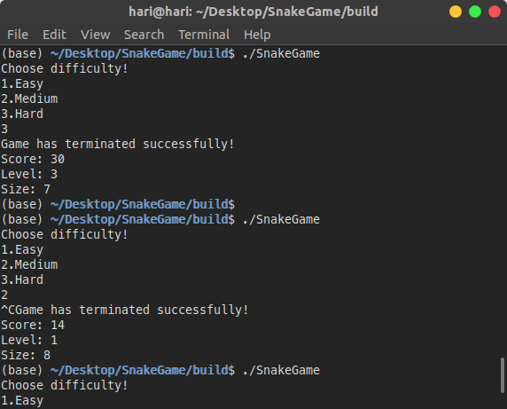
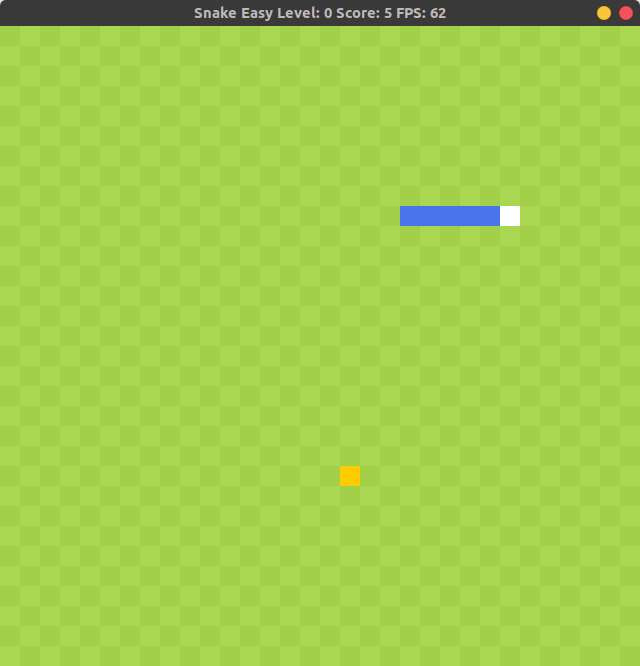
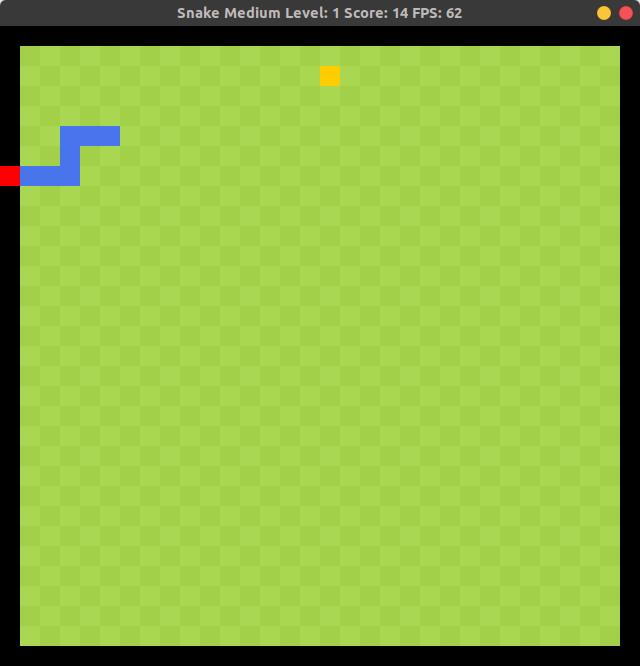
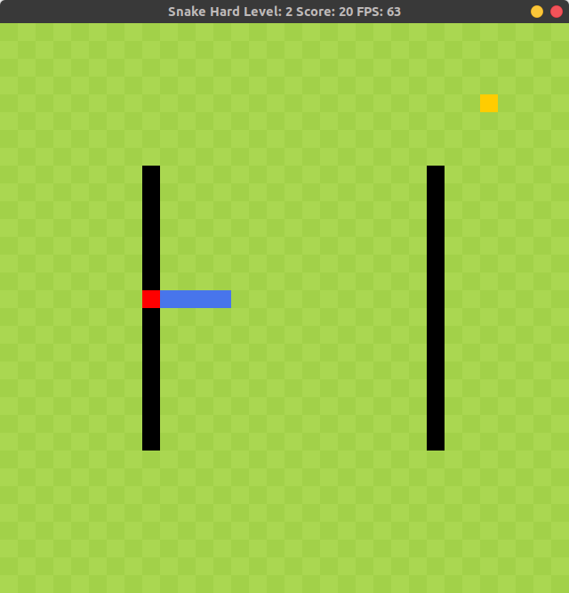
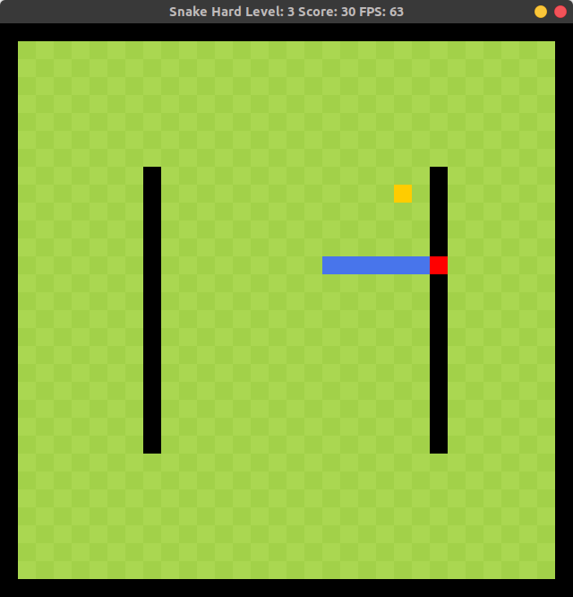

# Snake Game 

A snake game using SDL C++. Consists of 4 levels.

* Level 0 - No obstacles 
* Level 1,2,3 - Have Obstacles(black cells)

Player can choose the difficult.
* Easy - Score increase by one, speed of snake won't increase 
* Medium - Score increase by 2, speed increase 2%
* Hard - Score increase by 5, speed increase 3%

#### Level 0

#### Level 1

#### Level 2

#### Level 3

## Dependencies for Running Locally
* cmake >= 3.7
  * All OSes: [click here for installation instructions](https://cmake.org/install/)
* make >= 4.1 (Linux, Mac), 3.81 (Windows)
  * Linux: make is installed by default on most Linux distros
  * Mac: [install Xcode command line tools to get make](https://developer.apple.com/xcode/features/)
  * Windows: [Click here for installation instructions](http://gnuwin32.sourceforge.net/packages/make.htm)
* SDL2 >= 2.0
  * All installation instructions can be found [here](https://wiki.libsdl.org/Installation)
  * Note that for Linux, an `apt` or `apt-get` installation is preferred to building from source.
* gcc/g++ >= 5.4
  * Linux: gcc / g++ is installed by default on most Linux distros
  * Mac: same deal as make - [install Xcode command line tools](https://developer.apple.com/xcode/features/)
  * Windows: recommend using [MinGW](http://www.mingw.org/)

## Basic Build Instructions

1. Clone this repo.
2. Make a build directory in the top level directory: `mkdir build && cd build`
3. Compile: `cmake .. && make`
4. Run it: `./SnakeGame`.

## File Structure 

* main.cpp 
  - Take user inputs 
  - Run game
  - Print the results
* renderer.h renderer.cpp
  - class Render
  - Render the objects - grid, snake, food, obstacles
* snake.h snake.cpp
  - class Snake
  - functions - update snake, check whether a cell is obstacle or occupied by snake
* controller.h controller.cpp
  - class Controller
  - handle the input(key presses, quit)
* obstacles.h
  - class Obstacles
  - define the obstacle cells

## Rubric Addressed 

- [x]  Demonstrates C++ functions and control structures.
  - snake.cpp line no. 83
  - render.cpp line no. 48, 80
  - game.cpp line no. 83, 111
- [x]  Accepts user input and processes the input.
  - main.cpp line no. 12
- [x]  Uses Object Oriented Programming techniques.
  - obstacle.h line no. 9
- [x] Classes use appropriate access specifiers for class members.
  - game.h line no. 34, 35
- [x] Class constructors utilize member initialization lists.
  - game.cpp line no. 9
- [x] Classes abstract implementation details from their interfaces.
  - game.h line no. 21